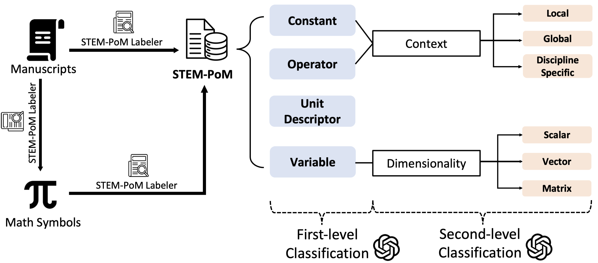

## STEM-PoM
This repo contains the STEM-PoM benchmark dataset.

### Prerequisites
* BeautifulSoup 4
* PyQt5

## Getting Started

* test_dataset is the actual dataset
* new_distribute.py contains a small GUI for users to annotate additional data to the dataset
* statistic.py will calculate several statistics about the dataset, basic info will be printed in the console, and detailed info will be stored at the end of the dataset
* extract.py contains several functions for the applications.

## Pipeline 

## STEM-PoM Labeler
  ```python
  cd labeler
  python new_distribute.py # run this to open the UI
  ```
  
  

  This GUI could be split into two parts, information rectangles and command buttons
    The first rectangle shows basic information about the symbol and which file it belongs to. 
    The other rectangles are the classification of the symbol shown on the top.
    Select the most appropriate attributes to classify a symbol and hit the submit button to send it to the dataset.

  short cuts

    [ / ] - Go to the next file
    [ , ] - check the previous symbol
    [ . ] - check the next symbol
    [ S ] - Submit the data to the dataset. (Conflict selections would be detected and rejected)
    [ R ] - Reset the selected attributes.
    [ 1 - 3 ] - Select between Variable, constant and Operator
    [ 4 - 6 ] - Select between Scalar, Vector and Matrix
    [ 7 - 9 ] - Select between Local, Global and Discipline_specified 
    [ 0 ] - Select Unit Descriptor

  The dataset
      
    The dataset contains all the data we collected from the ArxiV library. 
    It's been ordered into file name, order of this symbol in the file, the actual symbol, its attribute and related content
  

  
<!-- ## Contact
  
  Nickvash Kani - kani@illinios.edu
  
  Qing Wang - qingw3@illinois.edu
  
  Jiaru(Rubin) Zou - jiaruz2@illinois.edu

Project Link: [[https://github.com/github_username/repo_name](https://github.com/github_username/repo_name)](https://github.com/MLPgroup/Part_of_Math_tagging) -->
